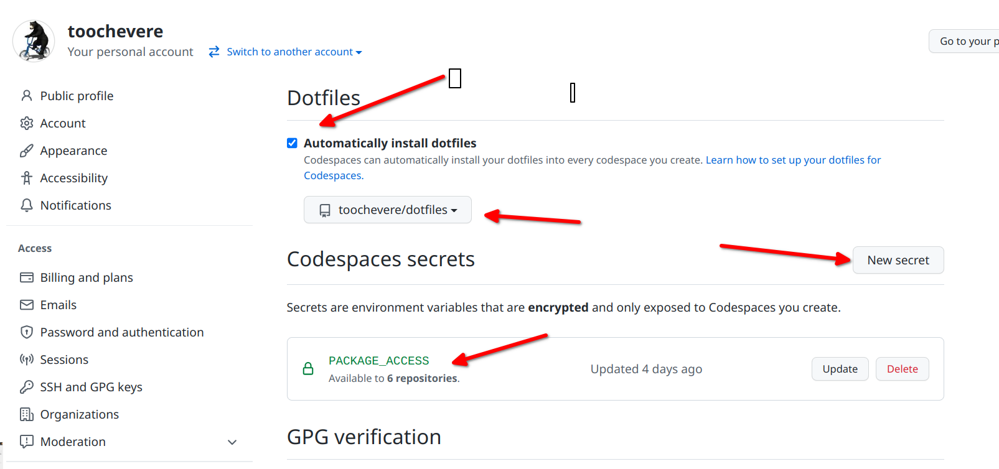

# dotfiles

To use this repository:

1. Install the extension for Github Codespaces in VS Code
    `code --install-extension github.codespaces`
1. Create a fork of the repository to your own github account
2. In your github Settings, go to Developer Settings and create a Personal Access Token (classic) with READ PACKAGE access.
3. Also in github Settings, go to Codespaces and...
    * Indicate you want to automatically install dotfiles
    * Pick your new `dotfiles` repository as the repository from which to install by default
    * Add a secret call `PACKAGE_ACCESS` with your Personal Access Token. 
    
